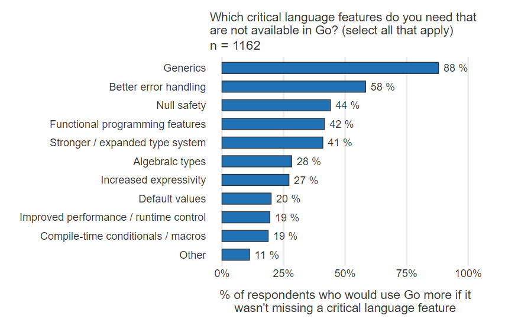

# Go 语言泛型介绍

## 前言

  
自从Go语言流行开来之后，每年都会调研征集开发者们的意见，最近几次泛型一直都是大家最希望加入的特性。  
随着 _Go 1.18 Beta 1_ 版本的发布，我们期待已久的泛型终于来了。官方还写了篇[入门教程](https://go.dev/doc/tutorial/generics)，介绍了下如何使用。只是这篇教程写得太过简略了，只是说了下如何配置环境，并给了一些代码样例，没有一份全面的使用方法描述。于是本人读了下最近被接受的泛型提案，根据提案中的内容整理出本文，尽可能地做出一个全面详尽的教程。

> 本文假定您是有一定经验的 Go 语言开发者，并且不具备其它语言的泛型编程经验。

## 什么是泛型

说起泛型，我们得先讲一讲**多态**（**Polymorphism**）。  
**多态**为不同数据类型的实体提供统一的接口，或使用一个单一的符号来表示多个不同的类型。
1967年计算机学者**Christopher Strachey**把多态定义为两个分支：**特设多态**（**Ad-hoc polymorphism**）和**通用多态**（**Universal polymorphism**）。后来由**Luca Cardelli**和**Peter Wegner**进一步完善了多态的概念。  
目前多态的概念包含以下内容：

### Ad-hoc

- Overloading
函数重载、操作符重载。
- Coercion
隐式和显式的类型转换。

### Universal（通用多态）

- Inclusion
子类型多态、继承。
- Parametric
类型参数。

我们通常所说的**泛型**指的是**参数化多态**（**Parametric polymorphism**）。

## 准备工作

阅读本文之前，强烈建议你先在本地配置一个开发环境，边阅读边敲代码做实验体验更佳。

### 安装 Go 1.18 Beta 1 版本

可以直接使用`go install`命令安装：

```sh
go install golang.org/dl/go1.18beta1@latest
# 可能需要蒋 $HOME/go/bin 加入PATH环境变量
go1.18beta1 download
alias go=go1.18beta1
go version
```

也可以使用 docker 镜像：

```sh
docker pull golang:1.18beta1-buster
docker run --rm -it golang:1.18beta1-buster bash
go version
```

成功的话，会输出对应的版本号：

```text
go1.18beta1 linux/amd64
```

### 创建项目

用以下命令创建一个示例项目

```sh
cd ~
mkdir generics
cd generics
go mod init example/generics
touch main.go
```

### 编写代码

用一个喜欢的编辑器打开`main.go`文件，写入以下代码：

```go
package main

import (
    "constraints"
    "fmt"
)

func SumInteger[T constraints.Integer](a, b T) T {
    return a + b
}

func main() {
    sum := SumInteger[int](1, 2)
    fmt.Println("sum:", sum)
}
```

有需要的可以使用编译器自带的工具格式化代码：

```sh
go fmt
```

### 运行

```sh
go run .
```

输出：

```text
sum: 3
```

## 类型参数

参数化多态的表现形式为，在语法元素上添加一系列类型参数。  
下面式Go语言定义类型参数的语法：

```text
func Foo[T any, ...](parameters...) ReturnType
```

- `T`为类型名，可以当作数据类型使用。
- `any`为约束，可以限定类型`T`的取值范围，这里`any`代表无任何约束，可以是任意类型。

### 泛型函数

前面的准备工作中我们写的示例代码里定义了一个泛型函数：

```go
func SumInteger[T constraints.Integer](a, b T) T {
    return a + b
}
```

函数`SumInteger`的参数`a`、`b`没有指定具体的类型，而是指定为`T`，并且在参数列表左侧加了一个方括号包裹的**类型参数**：`T constraints.Integer`。类型参数`T constraints.Integer`与非类型参数`a T, b T`共同作为函数`SumInteger`形式参数。我们可以认为参数`a`、`b`的类型为`T`，而参数`T`的约束为`constraints.Integer`（`constraints.Integer`的取值可以是`int`、`int8`、`int16`、`int32`、`int64`、`uint`、`uint8`、`uint16`、`uint32`、`uint64`、`uintptr`以及它们的派生类型，后文再详述）。函数的返回值的类型为`T`。

在调用泛型函数时和普通的函数的一样，需要传入实际的参数。  
同样是前面的例子：

```go
sum := SumInteger[int](1, 2)
```

函数调用`SumInteger[int](1, 2)`的实参为类型`int`和`int`类型的字面量`1`、`2`。由于类型参数`T`对应的实参为`int`，因此可以确定类型`T`为`int`，于是函数`SumInteger`的签名在此处可以确定为`func SumInteger(a, b int) int`。我们把这个行为叫做**实例化（Instantiate）**。  
所有泛型函数都必须实例化才能调用。

### 自定义类型

使用`type`关键字定义类型时，也可以加上类型参数。下面示例中类型参数的约束`any`表示`interface{}`即任意类型。

- 泛型结构体

```go
// 结构体的字段中可以引用类型参数
type Vector[T any] struct {
    inner []T
}

func (m *Vector[T]) Len() int {
    return len(m.inner)
}

// 方法实现中也可以引用类型参数
func (m *Vector[T]) Get(index int) T {
    return m.inner[index]
}

```

- 泛型内置容器

```go
// 数组
type Array[T any] [8]T

// 泛型切片
type Slice[T any] []T

// 泛型映射
type Map[K comparable, V any] map[K]V

// 泛型管道
type Chan[T] chan T
```

- 泛型接口

```go
type Iterator[T any] interface {
    Next() bool
    Value() T
}
```

实现改接口的类型也需要定义类型参数：

```go
type ListIter[T any] struct {
    index int
    inner []T
}

func (m *ListIter[T]) Next() (bool) {
    if m.index < len(m.inner) - 1 {
        m.index ++
        return true
    }
    return false
}

func (m *ListIter[T]) Value() T {
    if m.index >= 0 && m.index < len(m.inner) {
        return m.inner[m.index]
    }
    var empty T
    return empty
}
```

- 其它

```go
type Fn[A any, B any] func(A) B

type MyInt[T fmt.Stringer] int
...
```

## 约束

类型参数定义`[T any]`右边部分叫做**约束**。约束用来限定类型`T`的取值范围。  
Go 语言的接口类型可以直接作为约束来使用。如`[T fmt.Stringer]`中`T`的取值必须为实现了`fmt.Stringer`接口的类型。

### 新的接口元素

Go 语言原本的接口定义中只包含**方法签名**和**内嵌接口类型**。现在将接口作为约束使用时，又增加了三种新的元素：

- 非接口类型

```go
type Integer interface {
    int64
}
```

- 近似类型

```go
type Integer interface {
    ~int64
}
```

> 注意：近似类型元素必须定义为`~底层类型`，如 `~int`、`~[]int`、`~struct{ field1 int }`，而不能是`~MyInt`、`~MySlice`、`~MyStruct`。

- 联合类型

```go
// 联合类型约束
type Integer interface {
    int | int8 | int16 | int32 | int64
}

// 联合的近似类型约束
type Integer2 interface {
    ~int | ~int8 | ~int16 | ~int32 | ~int64
}
```

接口还内可以组合以上多种元素：

```go
type DispalyInteger interface {
    ~int | ~int8 | ~int16 | ~int32 | ~int64
    String() string
}
```

> 注意如果接口中添加了上文提到的三种元素之一，该接口就只能作为约束使用，不能作为一般类型来使用了。

### 匿名约束

```go
func Foo[T interface { ~int | int64 }]() {}
```

简化版本：

```go
func Foo[T ~int | int64]() {}
```

[更多例子](examples/constraints/main.go)。

### 类型集合

Go 语言中每一种类型都关联一个**类型集合**：

- 非接口类型 `T` 的类型集合是它自己：`{int}`, `{float32}`, `{string}`...；
- 空接口类型 `interface {}` 或者 `any`，类型集合为所有类型；
- 只包含方法签名的接口类型 `interface { f1(); f2(); f3()... }` 的类型集合为声明了这个接口内方法的所有类型：`{t : t declared {f1,f2,f3...}}`，后文简写为`{t: decl(t, Sfs)}`；
- 只包含内嵌接口的接口 `interface { M; N}` 的类型集合为 `M`、`N` 的类型集合的交集：`SM ∩ SN`；
- 包含近似类型和联合类型的接口类型的类型集合取决于其中的元素：
  - 包含近似类型 `~T` 的接口的类型集合是所有底层类型为 `T` 的类型：`{t : t ~ T}`；
  - 包含联合类型 `X | Y | Z` 的接口的类型集合是 `X`、`Y`、`Z` 各自的类型集合的并集：`SX ∪ SY ∪ SZ`；
- 多种元素组合的接口 `interface { M; X | Y | Z; f1(); f2(); f3()...}` 的类型集合为各集合的交集：
    `SM ∩ (SX ∪ SY ∪ SZ) ∩ { t : decl(t, Sfs)}`；
- 空类型集合是允许的，比如 `interface { int; string }`，Go 语言中不存在又是 `int` 又是 `string` 的类型：`{int} ∩ {string} = ∅`；

在对泛型类型实例化时，编译器会检查类型参数的实参和形参关联的类型集合，必须满足实参类型集合为形参类型集合的子集，才能成功进行实例化。

```go
// Ordered 的类型集合为 {t : t ~ int} ∪ {t : t ~ int8} ∪ {t : t ~ int16} ∪ ...
type Ordered interface {
    ~int | ~int8 | ~int16 | ~int32 | ~int64 |
        ~uint | ~uint8 | ~uint16 | ~uint32 | ~uint64 | ~uintptr |
        ~float32 | ~float64 |
        ~string
}

func Max[T Ordered](a, b T) T {
    if a > b {
        return a
    }
    return b
}

func main() {
    // {int} ⊆ SOrdered. 满足要求，可以实例化
    Max[int](1, 2)
    // {string} ⊆ SOrdered. 满足要求，可以实例化
    Max[string]("a", "b")
    // []byte ⊄ SOrdered. 不满足要求，无法实例化
    Max[[]byte]([]byte("hello"))
}
```

### 基于类型集合的操作

对于泛型类型的对象的操作都是由关联的类型集合来决定，只要集合中每一个元素都能使用某种操作，则改泛型类型的对象就可以使用这种操作。  
Go 语言并没有提供[运算符重载](https://en.wikipedia.org/wiki/Operator_overloading)的功能，而是基于类型集合来实现对泛型类型对象使用运算符的能力。

#### 调用接口方法

```go
// T 关联的类型集合为所有实现了 fmt.Stringer 接口的类型
func JoinSlice[T fmt.Stringer](elements []T, seperator string) string {
    var ret string
    for i, v := range elements {
        ret += v.String() // 类型T的对象可以使用其方法
        if i < len(elements) - 1 {
            ret += seperator
        }
    }
}
```

#### 内置类型的操作

- 可比较类型
    对于数字、字符串、布尔、指针等可以直接通过`==`和`!=`运算符做比较的数据类型，Go 语言提供了一个内置的约束`comparable`。

```go
// T 关联的类型集合为所有可比较的类型
func SearchIndex[T comparable](elements []T, target T) int {
    index := -1
    for i, e := range elements {
        if e == target { // 类型T的对象可以使用“==”比较
            index = i
            break
        }
    }
    return index
}
```

- 基本类型
    对于`int`、`float`等这种数字类型，可以比较大小和进行数学运算；`string`类型可以使用+操作来拼接、`len`函数来获取长度等。自定义约束的类型的对象同样也可以实现这些操作。

```go
// 有序类型，下面构成Ordered的的所有类型都是可以比较大小的
type Ordered interface {
    ~int | ~int8 | ~int16 | ~int32 | ~int64 |
        ~uint | ~uint8 | ~uint16 | ~uint32 | ~uint64 | ~uintptr |
        ~float32 | ~float64 |
        ~string
}

// T 关联的类型集合为 Ordered 对应的类型集合
func Max[T Ordered](a, b T) T {
    if a >= b { // 可以比较大小
        return a
    }
    return b
}
```

- 内置容器
    Go 语言内置的 `Slice`、`Map`、`Channel` 等容器类型都有各自的操作，要想让自定义约束能支持这些操作，也需要组成约束的所有类型都支持这些操作。

```go
// 自定义泛型Slice约束
type MySlice[T any] interface {
    []T
}

func ForEachMySlice[T any, S MySlice[T]](s S) {
    for _, e := range s {
        fmt.Println(e)
    }
}

// 自定义泛型Map约束
type MyMap[K comparable, V any] interface {
    map[K]V
}

func ForEachMyMap[K comparable, V any, M MyMap[K, V]](m M) {
    for k, v := range m {
        fmt.Println(k, v)
    }
}

// 自定义泛型Channel约束
type MyChan[T any] interface {
    chan T
}

func ForEachChan[T any, C MyChan[T]](c C) {
    for v := range c {
        fmt.Println(v)
    }
}
```

以上代码演示了对 Slice、Map、Channel 的 `for range` 操作，注意这三种容器类型虽然都支持 `for range` 操作，但是将他们联合成一个约束是不能进行 `for range` 的，因为每种类型的结构不同，`for range` 用法不一样，含义也不一样，不能混为一谈。

```go
type Iterable[K comparable, V any] interface {
    []V | map[K]V | chan V
}

// 不合法的操作
func ForEachIterable[K comparable, V any, T Iterable[K, V]](iter T) {
    for _, v := range iter {
        fmt.Println(v)
    }
}

// 编译器报错
// cannot range over iter (variable of type T constrained by Iterable[K, V]) (T has no structural type)
```

#### 标准库提供的约束

Go 标准库新增了一个名为`constraints`的包，里面定义了一些通用的约束。代码很少，这里直接贴出来给大家看看。[^l459]

```go
package constraints

type Signed interface {
        ~int | ~int8 | ~int16 | ~int32 | ~int64
}

type Unsigned interface {
        ~uint | ~uint8 | ~uint16 | ~uint32 | ~uint64 | ~uintptr
}

type Integer interface {
        Signed | Unsigned
}

type Float interface {
        ~float32 | ~float64
}

type Complex interface {
        ~complex64 | ~complex128
}

type Ordered interface {
        Integer | Float | ~string
}
```

## 类型推断

由于 Go 是静态类型语言，编译器解析代码时需要明确每个数据的类型，因此需要我们在声明变量时标注。

```go
var name string // 标注 name 为 string 类型
name = "go"
```

对于以上形式的代码，Go 语言提供了简化的方式：

```go
name := "go" // 编译器自动根据右值 "go" 推断 name 为 string 类型
```

这就是最基础的类型推断，如此一来我们就省略了变量的类型标注，简化了代码量。  
让我们回顾下前文中的例子：

```go
sum := SumInteger[int](1, 2)
```

上面代码中调用`SumInteger`传入了类型实参`int`。实际上从后面的非类型参数`(1, 2, 3)`中已经能够推断出 `SumInteger[T]()`的类型参数 `T` 为 `int`（常量被推断为 `int`）了，因此这里的`[int]`可以省略：

```go
sumVal := SumInteger(1, 2, 3) // 编译器自动根据函数实参 (1, 2, 3) 推断出 T 为 int 类型
```

### 类型合一化

Go 语言的类型推断基于类型合一化（Type unification）的操作。  
类型合一化会比较两个类型的结构，忽略掉类型参数的结构必须是相同的，除了类型参数之外的类型也必须相等。成功的类型合一化会提供一个匹配类型参数的列表。  
举个例子，如果`T1`和`T2`是类型参数，`[]map[int]bool`可以使用以下类型进行合一化（未列举出全部）：

- `[]map[int]bool`
- `T1` (`T1` 匹配 `[]map[int]bool`)
- `[]T1` (`T1` 匹配 `map[int]bool`)
- `[]map[T1]T2` (`T1` 匹配 `int`, `T2` 匹配 `bool`)

### 函数参数类型推断

对于函数参数的类型会根据传入的实际参数类型推断。  
如果传入的实参是无类型的常量则暂时忽略掉，继续推断后续类型参数，如果所有类型参数推断完毕后还存在未实例化的类型参数，则使用对应无类型常量实参的默认类型来推断。  
如果类型参数未出现在函数参数的类型中则不进行推断。

```go
// 存在类型参数 F、T
func Map[F, T any](s []F, f func(F) T) []T {
    r := make([]T, len(s))
    for i, v := range s {
        r[i] = f(v)
    }
    return r
}

// 比较实参 []int{1, 2, 3} 的类型 []int{} 与对应的形参 []F，[]int{} 可以与 []F 合一化，F 匹配 int。
// 比较实参类型 strconv.Itoa 的类型 func(i int) string 与对应的形参 func(F) T，func(i int) string 可以与 func(F) T 合一化 。由于上一步推断出 F 为 int，那么可以推导出 func(int) T，剩下的 T 就可以被推断为 string。
// 因此该函数的类型最终被实例化为 func (s []int, f func(int) string) []string。
strs := Map([]int{1, 2, 3}, strconv.Itoa)

// 存在类型参数 F
func NewPair[F any](f1, f2 F) *Pair[F] { ... }

// 实参都是无类型常量，使用默认的类型 int，可以与 F 合一化 ，F 匹配 int。
// 因此该函数的类型最终被推断为 func (f1, f2 int) *Pair[int]。
NewPair(1, 2)

// 第一个实参为无类型常量先跳过，第二个实参被指定了 int64 类型，F 匹配 int64。
// 因此该函数的类型最终被推断为 func (f1, f2 int64) *Pair[int64]。
NewPair(1, int64(2))
```

### 约束类型推断

如果存在类型参数`[T Constraint1[V], V Constraint2]`，编译器可以同时推断出`T`和`V`两个类型参数。但是此种类型推断只发生在以下情况之一：

- 类型参数 `T` 的约束 `Constraint1` 对应的类型集合中只包含一个类型；
- 类型参数 `T` 的约束 `Constraint1` 对应的类型集合中的所有类型的底层类型相同；

> `Constraint1`中可以定义方法，类型推断时会忽略方法。

```go
type SC[E any] interface {
    []E // 非接口类型元素
}

// 类型 S 由类型 E 协助推断
func DoubleDefined[S SC[E], E constraints.Number](s S) S {
    r := make(S, len(s))
    for i, v := range s {
        r[i] = v + v
    }
    return r
}

func main() {
    // 根据实参 []int{1} 和类型参数 E 推断类型参数 S
    v := DoubleDefined([]int{1})
    // ...
}
```

### 推断步骤

如果可以进行约束类型推断，那么函数的类型推断步骤如下：

1. 使用已知的类型参数构建映射关系；
2. 进行约束类型推断；
3. 使用有类型的实参进行函数类型推断；
4. 再次进行约束类型推断；
5. 针对剩余的无类型实参使用默认类型进行函数类型推断；
6. 再次进行约束类型推断；

[更复杂的例子](examples/type_inference/main.go)。

## 更多知识

### 引用自身的约束

假如我们想模拟一个`comparable`约束，尝试着这样写：

```go
type Equaler interface {
    Equal(Equaler) bool
}
```

上面这个定义是允许的，但是存在一个问题，`Equal`的参数是接口类型`Equaler`，这意味着传入的参数丢失了原本的类型（编译期），`Equal`的方法实现中需要对`Equaler`进行类型断言，存在运行时开销。  
Go 语言提供了一种匿名约束的方法来解决这个问题：

```go
func Index[T interface { Equal(T) bool }](s []T, e T) int {
    for i, v := range s {
        if e.Equal(v) {
            return i
        }
    }
    return -1
}
```

上面代码中的类型参数`[T interface { Equal(T) bool }]`中通过匿名约束的方式定义了`Equaler`约束。  
这样我们实现方法`Equal`的时候，参数就可以直接用 receiver 的类型了。

```go
type equalInt int

func (a equalInt) Equal(b equalInt) bool { return a == b }

func indexEqualInt(s []equalInt, e equalInt) int {
    return Index[equalInt](s, e)
}
```

### 约束中同时包含方法和元素

我们来看下面这个约束：

```go
type StringableSignedInteger interface {
    ~int | ~int8 | ~int16 | ~int32 | ~int64
    String() string
}
```

`StringableSignedInteger`同时包含联合类型和方法签名，下面的类型可以匹配上面的约束：

```go
type MyInt int

func (mi MyInt) String() string {
    return fmt.Sprintf("MyInt(%d)", mi)
}
```

我们可以看到约束内的联合类型都是由近似类型组合而成的，那么如果这里不用近似类型会怎么样呢？

```go
type StringableSignedInteger2 interface {
    int | int8 | int16 | int32 | int64
    String() string
}
```

这会导致类型`MyInt`不能与约束`StringableSignedInteger2`匹配（编译错误：`MyInt does not implement StringableSignedInteger2 (possibly missing ~ for int in constraint StringableSignedInteger2)`。  
原因在于`StringableSignedInteger2`的类型集合是`∅`（请回顾前文中关于类型集合的内容），`MyInt`的类型集合不可能为其子集。

### 指针方法

如果我们想写这样的函数：

```go
type Setter interface {
    Set(string)
}

func FromStrings[T Setter](s []string) []T {
    result := make([]T, len(s))
    for i, v := range s {
        result[i].Set(v)
    }
    return result
}

type Settable int

func (p *Settable) Set(s string) {
    i, _ := strconv.Atoi(s)
    *p = Settable(i)
}

func F() {
    // INVALID
    nums := FromStrings[Settable]([]string{"1", "2"})
    // 这里希望 nums 的值为 []Settable{1, 2}.
    ...
}
```

上面代码对于`Settable`类型的`FromStrings`调用是不合法的，因为`Settable.Set`方法需要 receiver 为指针类型。  
那么如果这样调用`FromStrings[*Settable]([]string{"1", "2"})`可以吗？  
可以编译通过，但是运行时会 panic，因为实例化之后`FromStrings`中第一行变为`result := make([]*Settable, len(s))`，`result`里面的元素其实是空指针，调用`Set`方法自然会 panic。
那怎么解决这个问题呢？我们可以这样定义`Setter`和`FromString`：

```go
type Setter[B any] interface {
    Set(string)
    *B // 非接口类型元素
}

func FromStrings[T any, PT Setter[T]](s []string) []T {
    result := make([]T, len(s))
    for i, v := range s {
        p := PT(&result[i])
        p.Set(v)
    }
    return result
}
```

如此一来就可以在`FromStrings`中调用指针的`Set`方法了（注意下面利用了类型推断使得我们只需要传如一个类型参数）：

```go
nums := FromStrings[Settable]([]string{"1", "2"})
```

### 类型转换

类型参数也可以用于变量的类型转换，可进行转换的前提是类型集合中的所有类型互相都可以进行转换。

```go
type Integer interface {
    ~int | ~int8 | ~int16 | ~int32 | ~int64 |
        ~uint | ~uint8 | ~uint16 | ~uint32 | ~uint64 | ~uintptr
}

type Number interface {
    ~int | ~int8 | ~int16 | ~int32 | ~int64 |
        ~uint | ~uint8 | ~uint16 | ~uint32 | ~uint64 | ~uintptr | float32 | float64
}

func Convert[To Integer, From Number](from From) To {
    to := To(from)
    if From(to) != from {
        panic("conversion out of range")
    }
    return to
}
```

### 反射

编译期所有泛型类型都会实例化，运行期是不存在泛型类型的，因此对于反射操作来说，只能查询到实例化之后的类型。

```go
fmt.Println(reflect.TypeOf(List[int]{1}))
// 运行输出 List[int]
```

## 存在的问题

### 返回零值

对于返回值为泛型类型的函数，如果想要返回零值，没有一个通用的字面量或者符号来表示这个泛型的零值。  
可以通过声明变量的方式来间接达到这个目的：

```go
func ZeroVal[T any]() T {
    var zero T
    return zero
}
```

### 识别泛型类型

我们可以通过`switch type`的语法测试泛型类型的对象：

```go
type Float interface {
    ~float32 | ~float64
}

func NewtonSqrt[T Float](v T) T {
    var iterations int
    switch (interface{})(v).(type) {
    case float32:
        iterations = 4
    case float64:
        iterations = 5
    default:
        panic(fmt.Sprintf("unexpected type %T", v))
    }
    // Code omitted.
}
```

但是`switch type`不能直接识别近似类型例如：

```go
type MyFloat float32
NewtonSqrt(MyFloat(64))
```

执行`NewtonSqrt`会导致 panic。  
`switch`语句块中不支持类似`case ~float32:`这样的语法。  
要使`switch type`能识别类型`MyFloat`，目前只能写成`case MyFloat:`。

### 不支持参数化的方法

```go
type S struct{}

func (S) Identity[T any](v T) T { return v }
```

## 不支持的特性

### 泛型类型特化

无法编写根据特定类型参数来调用特定实现版本的泛型函数（类比 C++的模板特化）。

### 基于泛型的元编程

指的是无法实现在编译期生成可执行代码的能力（类比 C++的模板元编程）。

### 高级抽象

除了调用或实例化之外无法使用带类型参数的函数；除了实例化之外无法使用泛型类型。

### 协变和逆变

由于 Go 中不存在类继承关系，因此类型参数也不支持协变和逆变。

### 柯里化

不能对泛型类型进行部分实例化或者进行包装，实例化泛型类型必须传入或者推断出所有的类型参数。

### 可变类型参数

不支持可变数量的类型参数。

### 参数化非类型值

类型参数不支持非类型值，例如自定义数组类型：

```go
type Matrix[n int] [n][n]float64
```

### 尝试整活的列子

- [Rank-N Types](examples/rankn_types/main.go)
- [Higher-kinded types](examples/simulate_hkt/doc.go)

## 参考文献

- <https://go.dev/doc/tutorial/generics>
- <https://go.googlesource.com/proposal/+/refs/heads/master/design/43651-type-parameters.md>

## 相关讨论

[点击进入讨论区](https://github.com/JinWuZhao/technique-sharing/issues/1)

## 注解

[^l459]: 来自A7103的评论：constraints包已经从标准库中被移除，同时添加到golang.org/x/exp/constraints。
