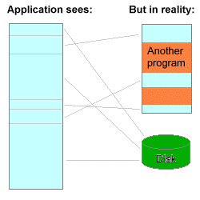
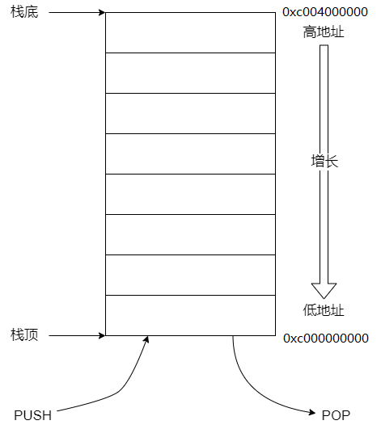
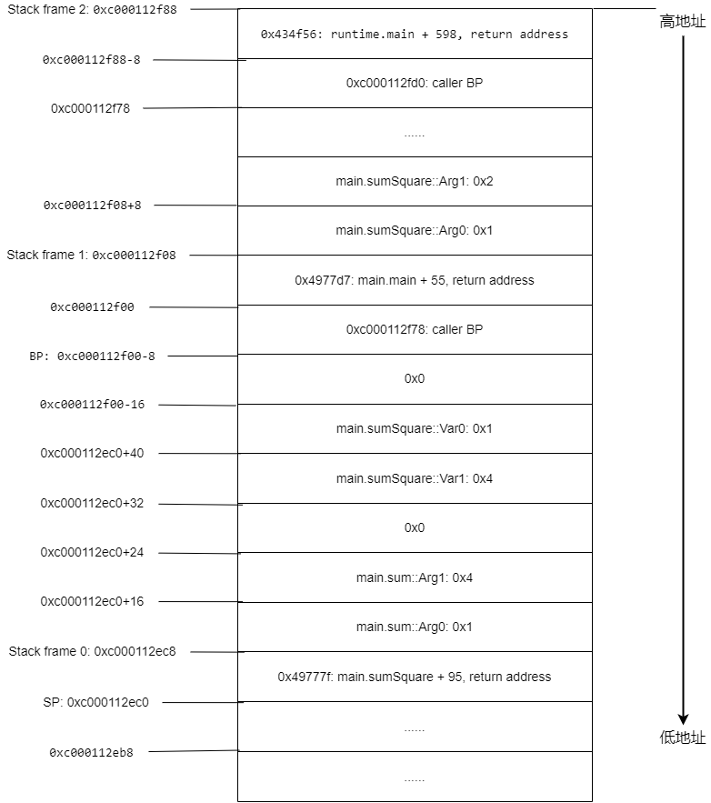

# Go语言底层探究

## 前言

// TODO

## 准备工作

本篇内容包含大量实验，读者们可以事先准备下本地的实验环境，边看边试验效果更佳。

- Linux系统环境
真机、虚拟机、WSL2都可，且需要安装Docker。

- 代码示例
请将代码示例[examples](examples)下载到本地，后面的实验中，以此目录作为工作目录。

- Go编译器
这里使用的Docker镜像，golang:1.16-buster, golang:1.17-buster, golang:1.18-buster，可以提前pull下来。  

启动命令参考，后文启动Go开发环境皆以此方式执行：

```sh
docker run --rm -it -v $PWD:/go/src/examples -w /go/src/examples --security-opt seccomp=unconfined golang:1.16-buster bash
```

命令中的参数 *--security-opt seccomp=unconfined* 是提供权限给gdb可以关闭内存地址随机化，方便我们做研究。

- GDB
在容器中安装：

```sh
apt-get update
apt-get install gdb
```

- 其它工具
objdump、readelf（容器环境自带）

## 内存布局

话题开始之前我们先回顾一些基础知识。

### 虚拟内存

虚拟内存是计算机系统内存管理的一种技术。它使得应用程序认为自己拥有连续可用的内存（一个连续完整的地址空间），而实际上物理内存通常被分隔成多个内存碎片，还有部分暂时存储在外部磁盘上，在需要时进行数据交换。  
如下图中所示，左边是应用程序的角度看到的内存空间，右边是在物理内存以及磁盘上上可能的空间分布。本文中只关注应用进程的虚拟内存空间，所以后文提到的“内存”皆指虚拟内存。  


### Go程序的内存分布

操作系统中，一个应用程序启动了之后，其进程的内存空间中，数据是怎样分布的呢？我们通过一个实验来亲眼看看。  

- 启动Go1.16开发环境
- 编译代码示例

```sh
# 注意这里的 -gcflags="-l" 用于关闭内联
go build -v -gcflags="-l" -o app ./memory_layout
```

- 使用gdb调试程序

启动gdb

```sh
gdb app
```

以下为gdb命令：

```text
b 10 # 在第10行设置断点
r # 运行程序

# 触发断点...

i proc mapping # 打印进程的内存布局，相当于"cat /proc/<pid>/maps"
```

执行了以上命令后，可以得到类似下面的结果：

```text
Mapped address spaces:

          Start Addr           End Addr       Size     Offset objfile
            0x400000           0x498000    0x98000        0x0 /go/src/examples/app
            0x498000           0x535000    0x9d000    0x98000 /go/src/examples/app
            0x535000           0x54b000    0x16000   0x135000 /go/src/examples/app
            0x54b000           0x57e000    0x33000        0x0 [heap]
        0xc000000000       0xc004000000  0x4000000        0x0 
      0x7fffd12e9000     0x7fffd369a000  0x23b1000        0x0 
      0x7fffd369a000     0x7fffe381a000 0x10180000        0x0 
      0x7fffe381a000     0x7fffe381b000     0x1000        0x0 
      0x7fffe381b000     0x7ffff56ca000 0x11eaf000        0x0 
      0x7ffff56ca000     0x7ffff56cb000     0x1000        0x0 
      0x7ffff56cb000     0x7ffff7aa0000  0x23d5000        0x0 
      0x7ffff7aa0000     0x7ffff7aa1000     0x1000        0x0 
      0x7ffff7aa1000     0x7ffff7f1a000   0x479000        0x0 
      0x7ffff7f1a000     0x7ffff7f1b000     0x1000        0x0 
      0x7ffff7f1b000     0x7ffff7f9a000    0x7f000        0x0 
      0x7ffff7f9a000     0x7ffff7ffa000    0x60000        0x0 
      0x7ffff7ffa000     0x7ffff7ffd000     0x3000        0x0 [vvar]
      0x7ffff7ffd000     0x7ffff7fff000     0x2000        0x0 [vdso]
      0x7ffffffde000     0x7ffffffff000    0x21000        0x0 [stack]
```

上面展示的是进程的内存布局，**Start Addr** 和 **End Addr** 为在内存中的开始地址和结束地址，**Size** 为数据大小（Byte），**objfile** 为内存映射的文件（如果存在的话则展示文件路径，其它带方括号的名称含义暂且忽略），**Offset** 为对应映射的文件中的偏移位置（未映射到文件的Offset为0x0）。  

示例项目 **memory_layout** 的代码中定义了一个全局变量 **gInt**，我们可以看一下它在内存中的位置。  
执行以下gdb命令：

```text
p &main.gInt # 打印gInt的地址
# 输出 (int *) 0x578288 <main.gInt>
```

联系前文的内存布局，可以发现 **main.gInt** 的地址 **0x578288** 位于 **0x54b000-0x57e000** 地址段的空间中（后面对应的objfile名称为 **heap** ）。  
再执行以下gdb命令：

```text
i symbol 0x578288 # 查询该地址对应的符号以及映射文件中的段（ELF文件中的Section）
# 输出 main.gInt in section .noptrbss of /go/src/examples/app
```

可以看到此地址来源于可执行文件app中的 **.noptrbss** 段，这个是Go编译器进行链接的时候自定义的段，意为非指针BSS段，BSS段是用于存储未初始化的全局变量的，那么这个自定义段就表示非指针的全局变量。  

示例项目 **memory_layout** 的代码中还定义了一个函数 **sum(a, b int) int**，我们看看这个函数位于哪里。  
执行以下gdb命令：

```text
p main.sum # 打印sum的信息
# 输出 {void (int, int, int)} 0x497700 <main.sum>
```

我们得到了sum函数的地址 **0x497700** ，继续查询该地址的符号：  

``` text
i symbol 0x497700
# 输出 main.sum in section .text of /go/src/examples/app
```

可以看到这个地址来源于可执行文件app的 **.text** 段，这个用于存储程序指令的段（也就是Go代码编译成的机器指令）。联系前文的内存布局，也可以看到这个函数在内存空间中的位置 **0x400000-0x498000** 地址段。  

再来看一下示例项目 **memory_layout** 中函数 **sum** 的参数 **a** 和 **b**。  
执行以下gdb命令：

```text
p &a # 打印a的地址
# 输出 (int *) 0xc000092f38
p &b # 打印b的地址
# 输出 (int *) 0xc000092f40
```

联系前文的内存布局，可以看到这两个参数的地址位于 **0xc000000000-0xc004000000** 地址段中，大家应该知道，**Go 1.17** 以前的版本中，函数的参数数据是分配在栈空间上的，这个地址段便包含了Go程序进程中的栈空间。  

gdb中还可以看到可执行文件中的各个段在内存中的分布情况：  

```text
i files
```

会得到以下信息：

```text
Symbols from "/go/src/examples/app".
Native process:
        Using the running image of child LWP 1137.
        While running this, GDB does not access memory from...
Local exec file:
        `/go/src/examples/app', file type elf64-x86-64.
        Entry point: 0x465760
        0x0000000000401000 - 0x00000000004977ca is .text
        0x0000000000498000 - 0x00000000004dbb64 is .rodata
        0x00000000004dbd00 - 0x00000000004dc42c is .typelink
        0x00000000004dc440 - 0x00000000004dc490 is .itablink
        0x00000000004dc490 - 0x00000000004dc490 is .gosymtab
        0x00000000004dc4a0 - 0x00000000005343a0 is .gopclntab
        0x0000000000535000 - 0x0000000000535020 is .go.buildinfo
        0x0000000000535020 - 0x00000000005432e4 is .noptrdata
        0x0000000000543300 - 0x000000000054aa90 is .data
        0x000000000054aaa0 - 0x00000000005781f0 is .bss
        0x0000000000578200 - 0x000000000057d510 is .noptrbss
        0x0000000000400f9c - 0x0000000000401000 is .note.go.buildid
        0x00007ffff7ffd120 - 0x00007ffff7ffd15c is .hash in system-supplied DSO at 0x7ffff7ffd000
        0x00007ffff7ffd160 - 0x00007ffff7ffd1a8 is .gnu.hash in system-supplied DSO at 0x7ffff7ffd000
        0x00007ffff7ffd1a8 - 0x00007ffff7ffd298 is .dynsym in system-supplied DSO at 0x7ffff7ffd000
        0x00007ffff7ffd298 - 0x00007ffff7ffd2f6 is .dynstr in system-supplied DSO at 0x7ffff7ffd000
        0x00007ffff7ffd2f6 - 0x00007ffff7ffd30a is .gnu.version in system-supplied DSO at 0x7ffff7ffd000
        0x00007ffff7ffd310 - 0x00007ffff7ffd348 is .gnu.version_d in system-supplied DSO at 0x7ffff7ffd000
        0x00007ffff7ffd348 - 0x00007ffff7ffd458 is .dynamic in system-supplied DSO at 0x7ffff7ffd000
        0x00007ffff7ffd458 - 0x00007ffff7ffd798 is .rodata in system-supplied DSO at 0x7ffff7ffd000
        0x00007ffff7ffd798 - 0x00007ffff7ffd7ec is .note in system-supplied DSO at 0x7ffff7ffd000
        0x00007ffff7ffd7ec - 0x00007ffff7ffd820 is .eh_frame_hdr in system-supplied DSO at 0x7ffff7ffd000
        0x00007ffff7ffd820 - 0x00007ffff7ffd910 is .eh_frame in system-supplied DSO at 0x7ffff7ffd000
        0x00007ffff7ffd910 - 0x00007ffff7ffddaa is .text in system-supplied DSO at 0x7ffff7ffd000
        0x00007ffff7ffddaa - 0x00007ffff7ffde1f is .altinstructions in system-supplied DSO at 0x7ffff7ffd000
        0x00007ffff7ffde1f - 0x00007ffff7ffde3b is .altinstr_replacement in system-supplied DSO at 0x7ffff7ffd000
```

从上面信息中可以看到 **Entry point: 0x465760** 这一行，地址 **0x465760** 为程序的入口，可以看以下这个地址的详细信息：  

```text
i symbol 0x465760
# 输出 _rt0_amd64_linux in section .text of /go/src/examples/app

list *_rt0_amd64_linux # 查看该函数的定义
# 输出结果
0x465760 is in _rt0_amd64_linux (/usr/local/go/src/runtime/rt0_linux_amd64.s:8).
3       // license that can be found in the LICENSE file.
4
5       #include "textflag.h"
6
7       TEXT _rt0_amd64_linux(SB),NOSPLIT,$-8
8               JMP     _rt0_amd64(SB)
9
10      TEXT _rt0_amd64_linux_lib(SB),NOSPLIT,$0
11              JMP     _rt0_amd64_lib(SB)

list *_rt0_amd64
# 输出结果
0x4621c0 is in _rt0_amd64 (/usr/local/go/src/runtime/asm_amd64.s:15).
10      // _rt0_amd64 is common startup code for most amd64 systems when using
11      // internal linking. This is the entry point for the program from the
12      // kernel for an ordinary -buildmode=exe program. The stack holds the
13      // number of arguments and the C-style argv.
14      TEXT _rt0_amd64(SB),NOSPLIT,$-8
15              MOVQ    0(SP), DI       // argc
16              LEAQ    8(SP), SI       // argv
17              JMP     runtime·rt0_go(SB)
18
19      // main is common startup code for most amd64 systems when using

i address runtime.rt0_go # 打印runtime.rt0_go函数的地址
# 输出 Symbol "runtime.rt0_go" is a function at address 0x4621e0.

list *0x4621e0
# 输出结果
0x4621e0 is in runtime.rt0_go (/usr/local/go/src/runtime/asm_amd64.s:91).
86
87      // Defined as ABIInternal since it does not use the stack-based Go ABI (and
88      // in addition there are no calls to this entry point from Go code).
89      TEXT runtime·rt0_go<ABIInternal>(SB),NOSPLIT,$0
90              // copy arguments forward on an even stack
91              MOVQ    DI, AX          // argc
92              MOVQ    SI, BX          // argv
93              SUBQ    $(4*8+7), SP            // 2args 2auto
94              ANDQ    $~15, SP
95              MOVQ    AX, 16(SP)

# 默认只输出10行，想查看更多，可以用以下命令设置最大显示行数为100行
set listsize 100
```

以上例子给出了一个从入口探寻go程序的执行过程的一个方法，感兴趣的朋友可自行尝试。

### Go语言函数调用过程

各位可能有了解过一些函数调用中的知识，比如函数的栈帧、压栈和弹栈等等，这些底层的知识在很多语言中都存在，现在我们在Go程序中回顾一下。  

#### 调用栈

调用栈（Call stack）是进程内存中的一片连续的区域，发生函数的调用的时候，程序会在这片区域上申请一段空间用以存放参数、局部变量等信息，函数返回时，会将这段空间销毁。  
程序对这片内存区域的操作是按照栈结构的“先进后出”来进行的，通常栈由内存中的高地址向低地址增长，即栈底位于高地址处，栈顶位于低地址处，栈增长的行为叫做“压栈/入栈”（push），栈减小的行为叫做“弹栈/出栈"（pop）。  
以下为栈空间的示意图：  


#### 寄存器

寄存器（Register）是CPU用来暂存指令、数据和地址的存储器，容量非常有限，但是读写速度很快。  
CPU中的寄存器有很多种，不同的CPU架构的寄存器种类和数量也各有不同，这里以x86_64为例介绍一些常用的寄存器。  

- 数据寄存器
用来存放操作数、结果和信息的多个寄存器，如AX、BX、CX、DX等。

- 指令指针寄存器IP
又称作程序计数器（PC），用来储存要执行的下一条指令的地址，每执行一条指令后IP寄存器的值都会变化。

- 栈指针寄存器SP
用来存储调用栈内存区域的地址，总是指向栈顶，可以通过对SP的偏移操作来实现压栈和弹栈。

- 基指针寄存器BP
用于备份SP的值，在栈中辅助寻址用，通常保存的是函数临时变量区域的起始地址。

64位CPU的单个寄存器最多可以存储8字节的数据，对寄存器的访问支持指定数据宽度：8位、16位、32位、64位。后文中你可能会在汇编指令中看到如al、ah、ax、eax、rax这样的寄存器名称，这些都是对AX寄存器的不同访问方式，注意并不是所有寄存器都支持这样的访问。

#### 栈帧

栈帧也叫过程活动记录，是编译器用来实现过程/函数调用的一种数据结构。  
每一次的函数调用，都会在调用栈上维护一个栈帧（Stack Frame），每个栈帧通常包括：  

- 传递给函数的参数
- 函数的返回到调用者的地址(return address)
- 临时变量空间，包含函数中的局部变量和编译器自动生成的临时数据。
- 函数调用者的BP寄存器值(caller BP)

我们来做一个实验，使用Go 1.16编译示例 **function_call**：

```sh
# 为了能让结果更清晰，我们使用 -gcflags="-N -l" 来关闭优化和内联
go build -v -gcflags="-N -l" -o app ./function_call
```

使用gdb调试该程序：

```sh
gdb app
```

在第6行设置一个断点并运行触发该断点，该断点位于sumSquare函数中：

```text
b 6
r
```

查看当前断点处的调用栈数据：

```text
i frame 0
# 输出以下内容
Stack frame at 0xc000112ec8:
 rip = 0x497709 in main.sum (/go/src/examples/function_call/main.go:6); saved rip = 0x49777f
 called by frame at 0xc000112f08
 source language unknown.
 Arglist at 0xc000112eb8, args: a=1, b=4, ~r2=0
 Locals at 0xc000112eb8, Previous frame's sp is 0xc000112ec8
 Saved registers:
  rip at 0xc000112ec0

i frame 1
# 输出以下内容
Stack frame at 0xc000112f08:
 rip = 0x49777f in main.sumSquare (/go/src/examples/function_call/main.go:12); saved rip = 0x4977d7
 called by frame at 0xc000112f88, caller of frame at 0xc000112ec8
 source language unknown.
 Arglist at 0xc000112ec0, args: a=1, b=2, ~r2=0
 Locals at 0xc000112ec0, Previous frame's sp is 0xc000112f08
 Saved registers:
  rip at 0xc000112f00

i frame 2
# 输出以下内容
Stack frame at 0xc000112f88:
 rip = 0x4977d7 in main.main (/go/src/examples/function_call/main.go:16); saved rip = 0x434f56
 caller of frame at 0xc000112f08
 source language unknown.
 Arglist at 0xc000112f00, args: 
 Locals at 0xc000112f00, Previous frame's sp is 0xc000112f88
 Saved registers:
  rip at 0xc000112f80
```

先解释下上面的内容：

- 命令 i frame n
输出相对于断点处的栈帧信息，n=0 代表断点处所在的函数，n=1 则是更外一层的函数（即caller），以此类推。
- Stack frame at 0xnnnnnn
栈帧的起始地址，栈帧从此地址开始往低地址处延申。
- rip = 0xnnnnn in main.foo (...); saved rip = 0xnnnnn
rip就是IP寄存器（64位值)，这里指在此函数中要执行的下一条指令（后面跟着源代码中的位置），可能是断点处接下来的指令（frame 0 的函数），也可能是调用其它函数后的下一条指令。 saved rip 是指Caller调用该函数后的下一条指令，可以观察下上面的三个栈帧的rip和saved rip的值，会发现saved rip其实就是caller的rip。
- called by frame at 0xnnnnnnnnn, caller of frame at 0xnnnnnnnnn
called by frame at 0xnnnnnnnnn是指该函数的caller的栈帧位置，caller of frame at 0xnnnnnnnnn指的是该函数中发生函数调用时callee的栈帧位置。
- Arglist at 0xnnnnnnnnn, args: ...
看描述是参数列表的起始地址，但其实并不是，要往高地址偏移一段跳过saved rip部分才是该函数的参数列表。
- Locals at 0xnnnnnnnnn, Previous frame's sp is 0xnnnnnnnnn
Locals at 0xnnnnnnnnn是局部变量的起始地址，这里的值跟Arglist一样了，我猜可能是gdb分辨不出来实际局部变量的位置。Previous frame's sp指前一个栈帧的栈顶也就是当前栈帧的起始地址。
- Saved registers: rip at 0xnnnnnnnnn
在栈帧中保存的寄存器值所在的地址，这里的rip指的就是上面的saved rip，这个saved rip我们一般称之为return address。

再介绍一些gdb的小技巧，以方便各位查看调用栈和寄存器的数据。

- 打印内存中的值

> x/nfu addr
含义为以f格式打印从addr开始的n个长度单元为u的内存值。参数具体含义如下:  
n：输出单元的个数，可以省略，默认为1。  
f：是输出格式。比如x是以16进制形式输出，o是以8进制形式输出等等。  
u：标明一个单元的长度。b是一个byte，h是两个byte（halfword），w是四个byte（word），g是八个byte（giant word）。  
addr: 内存地址
比如打印 **stack frame 0: 0xc000112f08** 的值：

```text
x/xg 0xc000112ec8
# 输出 0xc000112ec8:   0x0000000000000001
```

addr还可以是表达式：

```text
x/gx 0xc000112ec8+8 # 打印内存中0xc000112ec8向高地址偏移8个字节处的值，注意后面的8是十进制的
# 输出 0xc000112ed0:   0x0000000000000004
```

- 打印寄存器的值
  
```text
i register rsp # 输出单个寄存器的值
i registers # 输出当前用到的所有寄存器的值
```

使用gdb探索上面栈帧的输出信息，我们能描绘出当前调用栈的结构如下图：  


上面图中的caller BP指的是caller中BP寄存器的值，大家可以留意下图中的caller BP指向的位置。图中需要留意的是，函数的参数和局部变量在调用栈上的排列顺序，这属于Go语言中的一种调用约定。

## 底层实现

我们编译Go代码得到的可执行文件中的 **.text** 段中的内容是给CPU执行的二进制机器指令，我们可将其反汇编为汇编指令，来探究下Go程序离机器最近时的样子。  

使用Go 1.16编译示例 **function_call**， 使用容器环境中自带的工具 **objdump** 对生成的可执行文件反汇编：

```sh
go build -v -gcflags="-N -l" -o app ./function_call
objdump -S -d ./app > app.dump
```

用文本编辑器打开生成的文件 **app.dump**，搜索字符串 **<main.main>:**，定位到出现的位置，下面隔两行找到 **func main() {** 下面的代码，直到文件末尾，下面节选出来（省略了一些辅助信息和不重要的部分）：

```text
  ...........................
  4977b3: 48 83 ec 78           sub    $0x78,%rsp
  4977b7: 48 89 6c 24 70        mov    %rbp,0x70(%rsp)
  4977bc: 48 8d 6c 24 70        lea    0x70(%rsp),%rbp

  4977c1: 48 c7 04 24 01 00 00  movq   $0x1,(%rsp)
  4977c8: 00 
  4977c9: 48 c7 44 24 08 02 00  movq   $0x2,0x8(%rsp)
  4977d0: 00 00 
  4977d2: e8 49 ff ff ff        callq  497720 <main.sumSquare>
  4977d7: 48 8b 44 24 10        mov    0x10(%rsp),%rax
  4977dc: 48 89 44 24 30        mov    %rax,0x30(%rsp)

  ...........................
  497870: 48 8b 6c 24 70        mov    0x70(%rsp),%rbp
  497875: 48 83 c4 78           add    $0x78,%rsp
  497879: c3                    retq   
```

上面的展示的是示例程序 **function_call** 中main函数的一部分反汇编内容。

### 汇编语言

汇编语言是一种低级语言，它使用助记符来代替和表示特定机器语言的操作指令。基本上汇编语言是与特定的机器语言指令集是一一对应的，本文中所采用的是**Intel x86_64**（又称**amd64**）架构的指令集。汇编语言有两大风格分别是**Intel**汇编和**AT&T**汇编。上文中使用的objdump工具得到的反汇编结果中的汇编语言是**AT&T**风格的（objdump工具默认采用AT&T汇编，也可以通过 **-M intel** 参数指定为Intel汇编）。  

回到上节最后的main函数的反汇编结果，可以看出存在一个统一的格式，以第一行为例：

- 4977b3
可执行文件 **.text** 段中指令的地址，也对应进程内存中的地址（回顾前文的内存布局一节），注意这里是16进制的。
- 48 83 ec 78
对应的机器指令16进制码，空格分隔的每一个数字是一字节，这条指令占四字节。
- sub $0x78,%rsp
这个才是真正的汇编指令了，语法大致是：操作指令 [操作数,...]，**sub**就是操作指令，**$0x78,%rsp**则是两个操作数。  
操作指令有很多种，取决于架构支持的指令集数量，常用的也就几十种。
每种操作指令各自都有操作数的要求，大多是0~2个。  
操作数可能是（包括但不限于）：  
  - 立即数
  **$**前缀的字面量的常数如：$0x1。
  - 寄存器
  **%**前缀的寄存器名称如：%rsp。
  - 直接寻址
  **FOO** 或者 **\$FOO** ，FOO指的是一个全局变量，带$的表示直接引用地址，不带的则是取内存的值。
  - 间接寻址
  格式为：immed32(basepointer, indexpointer, indexscale)，表示的地址为：immed32 + basepointer + indexpointer × indexscale。这里immed32是32位的立即数，basepointer是基础指针，indexpointer是索引指针，indexscale是索引的缩放值即倍数，basepointer和indexpointer一般是寄存器。

汇编语言暂时就讲这些，由于本文目的不是汇编教学，因此不会进行全面地介绍，有兴趣的朋友可以自行找相关资料学习。

### 汇编分析

我们大致分析一下上面dump出的汇编代码。  
下面是示例程序 **function_call** 种main函数里调用sumSquare函数的相关指令，为方便理解加上了一些注释：

```asm
  ; ...........................
  sub    $0x78,%rsp                  ; 用rsp的值减去0x78并存放到rsp里。
                                     ; 相当于将SP向低地址移动了0x78字节，
                                     ; 也就是调用栈的栈顶增长了0x78字节。

  mov    %rbp,0x70(%rsp)             ; 将rbp的值存放到内存中rsp+0x70地址处（相对寻址）。
                                     ; 相当于在距离栈顶0x70字节处存储了当前BP的值（即caller BP），
                                     ; 这个BP值位于内存中 (rsp+0x78, rsp+0x70] 区间内。

  lea    0x70(%rsp),%rbp             ; 将rsp+0x70地址处的内存值存放到rbp中。即修改了当前的BP。

  movq   $0x1,(%rsp)                 ; 将立即数0x1存放到内存中rsp地址处，
                                     ; 位于内存中 (rsp+0x8, rsp] 区间内。
                                     ; 该值是main.sumSquare的第一个参数。

  movq   $0x2,0x8(%rsp)              ; 将立即数0x2存放到内存中rsp+0x8地址处，
                                     ; 位于内存中 (rsp+0x10, rsp+0x8] 区间内。
                                     ; 该值是main.sumSquare的第二个参数。

  callq  497720 <main.sumSquare>     ; 调用内存中497720地址处的函数。同时将rsp增加0x8，
                                     ; 将rip的值存放到内存中rsp地址处，
                                     ; 相当于把当前IP（下一条指令的地址）压入栈顶（即return address）。
                                     ; 后面跟着的是该处的符号描述即main.sumSquare。

  mov    0x10(%rsp),%rax             ; 将内存中rsp+0x10地址处的值存放到rax中，
                                     ; rsp+0x10地址处存储着main.sumSquare的返回值。

  mov    %rax,0x30(%rsp)             ; 将rax的值存放到内存中rsp+0x30地址处。
                                     ; 这里是给后面省略的调用fmt.Println部分准备的。

  ; ...........................

  mov    0x70(%rsp),%rbp             ; 将内存中rsp+0x70地址处的值存放到rbp中，
                                     ; 这里呼应开头第二行的指令mov %rbp,0x70(%rsp)，
                                     ; 也就是恢复BP到原值（caller BP）。

  add    $0x78,%rsp                  ; 用rsp的值加上0x78并存放到rsp里。
                                     ; 相当于将SP向高地址移动了0x78字节，
                                     ; 即调用栈的栈顶减小了0x78字节（呼应第一行指令sub $0x78,%rsp）。

  retq                               ; 表示main.main函数返回，
                                     ; 这个行为会将IP的值改为main.main函数caller（即rumtime.main）
                                     ; 中的return address，并且将该return address从栈顶弹出。
```

以上汇编代码中，有个隐含的行为是：每一行指令执行后，IP寄存器都会自动增加（指向下一行指令的地址）。  

接下来我们再看看main.sumSquare函数的汇编代码，按照前文的方法，在 **app.dump** 中搜索字符串 **<main.sumSquare>:**，就能找到对应的dump信息。这里我们直接节选汇编代码部分（省略一些不重要的内容，上面汇编代码中注释过的相似内容，下面就不再赘述了）：

```asm
  sub    $0x38,%rsp         ; 栈顶增长0x38字节。
  mov    %rbp,0x30(%rsp)    ; 保存caller BP。
  lea    0x30(%rsp),%rbp    ; 修改当前BP。

  movq   $0x0,0x50(%rsp)    ; 将(rsp+0x58, rsp+0x50]区间置空。
                            ; 这里的rsp+0x50等价于main.main函数中的rsp+0x10，
                            ; 也就是main.sumSquare的返回值。
  
  mov    0x40(%rsp),%rax    ; 这里的rsp+0x40等价于main.main函数中的rsp，
                            ; 也就是main.sumSquare的第一个参数。
  
  mov    0x40(%rsp),%rcx    ; 这里引入一个新的寄存器rcx用于后面乘法运算和存放结果。
  
  imul   %rax,%rcx          ; 将rax与rcx的值相乘，结果存放于rcx中。即 sqa := a * a 。
  
  mov    %rcx,0x20(%rsp)    ; 这里rsp+0x20处的值作为局部变量sqa。
  
  mov    0x48(%rsp),%rax    ; 这里rsp+0x48等价于main.main函数中的rsp+0x8，
                            ; 也就是main.sumSquare的第二个参数。
  
  mov    0x48(%rsp),%rcx    ; 这里复用寄存器rcx用于后面乘法运算和存放结果。
  
  imul   %rax,%rcx          ; 将rax与rcx的值相乘，结果存放于rcx中。即 sqb := b * b 。
  
  mov    %rcx,0x18(%rsp)    ; 这里rsp+0x18处的值作为局部变量sqb。
  
  mov    0x20(%rsp),%rax    ; 将rsp+0x20地址处的内存值存放到rax中。
  
  mov    %rax,(%rsp)        ; 这里rsp处的值作为main.sum的第一个参数。
  
  mov    %rcx,0x8(%rsp)     ; 这里rsp+0x8处的值作为main.sum的第二个参数。
  
  callq  497700 <main.sum>  ; 调用497700地址处的函数 main.sum。
  
  mov    0x10(%rsp),%rax    ; 这里rsp+0x10处的值为main.sum的返回值。
  
  mov    %rax,0x28(%rsp)    ; 此处同样为main.sum的返回值，看起来冗余了，
                            ; 因为编译关闭了优化，这里就不纠结意义了。
  
  mov    %rax,0x50(%rsp)    ; 这里rsp+0x50为main.sumSquare的返回值。

  mov    0x30(%rsp),%rbp    ； 恢复BP为原值caller BP。
  add    $0x38,%rsp         ; 栈顶减小0x38字节。
  retq                      ; main.sumSquare函数返回。
```

上面的汇编代码中，可以看出main.sumSquare函数与main.main函数的汇编代码的开头和结尾非常的相似，都包含栈增长和减小、保存caller BP和恢复BP等操作。  
留意下同一个内存地址在main.sumSquare(callee)中与main.main(caller)中相对SP的偏移量，可以用此公式换算：  
> offset(caller) = offset(callee) - stacksize(callee) - size(return address)  
比如main.sumSquare中的rsp+0x40与main.main函数中的rsp：
> 0 = 0x40 - $0x38 - 8

大家如果结合前面通过gdb信息描绘出的调用栈结构图来分析这节的汇编代码，会有更深刻的体会。

## 手写汇编

实现函数

## 参数传递（栈和寄存器，参数类型）

压栈过程，参数传递方法，栈传递参数和寄存器传递参数，各参数类型的传递方法。

## 控制结构

## 泛型实现

Go 1.18Beta2

## 其他知识

sadfasdf
